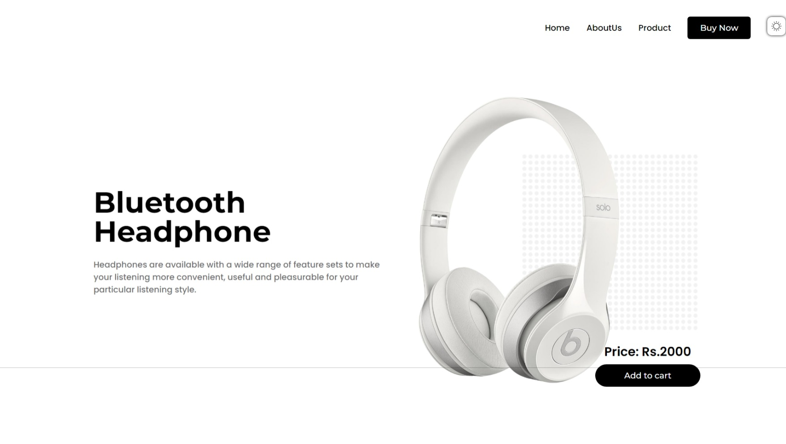

# *Theme-Switcher*

## 1. Lightmode-Switching

### This using JavaScript to toggle between light and dark modes. This involves adding or removing a CSS class on the body or a main container element.Store the user’s theme preference in localStorage to maintain their choice across sessions.

## 2. Darkmode-Switching

### Dark mode is a user interface theme that uses a dark background and light text, which can reduce eye strain, especially in low-light conditions. It has become increasingly popular in modern web design due to its aesthetic appeal and usability benefits.

**Benefits of Dark Mode :**

- Reduced Eye Strain:  Dark mode can be easier on the eyes, particularly in low-light environments.

- Battery Saving: On OLED and AMOLED screens, dark mode can save battery life because black pixels use less power.

- Focus: It can help users focus on the content by reducing the amount of light emitted from the screen.

**Best Practices :**
1) Responsive Design: Ensure the light mode layout is responsive and works well on all devices, including desktops, tablets, and mobile phones.

2) Performance Optimization: Optimize images and other assets to ensure fast loading times.

3) Cross-Browser Compatibility: Test the light mode on different browsers to ensure consistent behavior and appearance.

4) User Preferences: Save user preferences for light or dark mode using local storage or cookies, so the chosen mode is retained on subsequent visits.